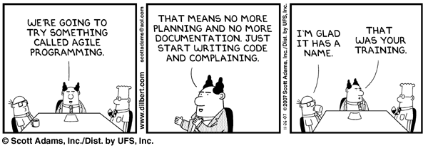
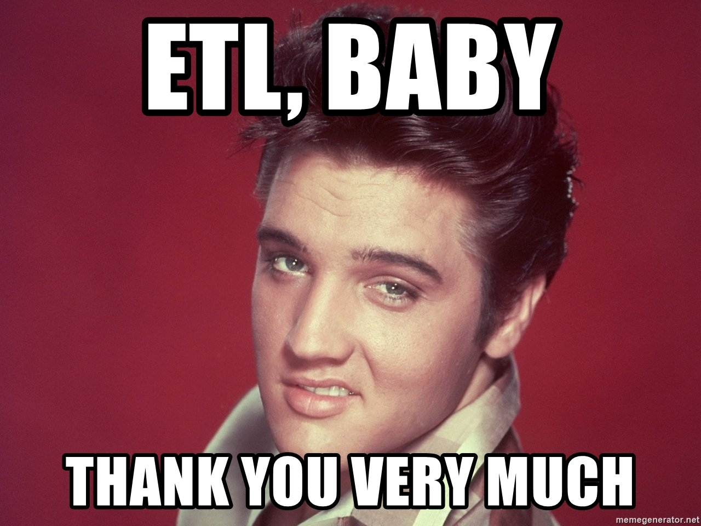

# MINI ETL Project 

Kelly McVey / Wenbin Zhao Billy

## Summary
For our ETL project we will be collecting stock market data from the S&P for the last 5 years using Kaggle, along with consumer confidence index data from OECD. They come in the form of CSV files, and will be joined by date. Since the consumer confidence data ia based on quarter averages, we will need to find the averages for all 500 companies over the same time period. 

## Extract
Both data sets are in CSV format. We need to make some selections on the source webpage in order to download the proper format.
After downloading the CSV files. We use pandas to load them into dataframes.

### Data Sources
#### 1. US Monthly Consumer Confidence Index Data from 2013 - 2018 (5 Years)
https://data.oecd.org/leadind/consumer-confidence-index-cci.htm

#### 2/ US S&P 500 Companies Stock Market Performance from 2013 - 2018 (5 Years)
https://www.kaggle.com/camnugent/sandp500/version/4#

## Transform
#### for S&P 500 data, the following transformation and aggregations were performed:
1. All stocks are grouped by month
2. An average (mean) aggregated value was calculated from closing price.
3. Date format is changed to YYYY-MM format, renamed column to "month"

#### for Consumer Confidence Index data set, the following transform were performed:
1. only select country US
2. change time filed name to 'month' in order to match with S&P500 data set

#### merge both dataframes together by joining on 'month' = 'month'
1. final dataset (merged data) is completed product / dataset

## Load
#### Merged Data is transferred to PostgreSQL database by using SQLAlchamy (to_sql function).

## Final Analysis

